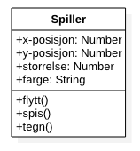
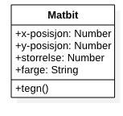
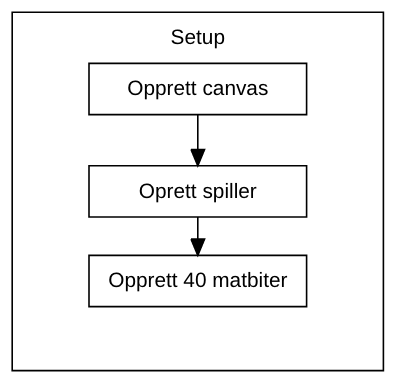
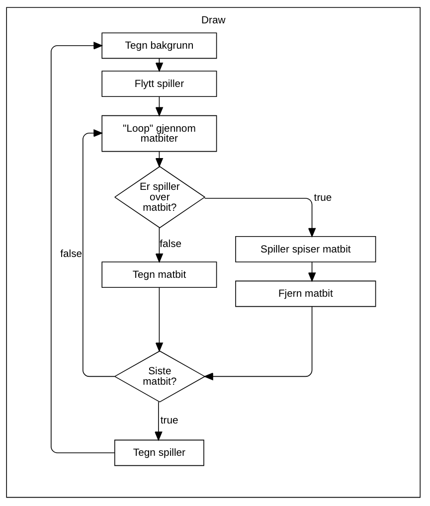

# Spillprogrammering - Agar

Stikkord:
- P5
- Objekt-orientert programmering
- Array
- Løkker

Relevante filmer:
- [7.3: Arrays of Objects](https://www.youtube.com/watch?v=fBqaA7zRO58&list=PLRqwX-V7Uu6Zy51Q-x9tMWIv9cueOFTFA&index=29)
- [7.4: Mouse Interaction with Objects](https://www.youtube.com/watch?v=TaN5At5RWH8&list=PLRqwX-V7Uu6Zy51Q-x9tMWIv9cueOFTFA&index=31)
- [7.5: Removing Objects from Arrays](https://www.youtube.com/watch?v=tA_ZgruFF9k&list=PLRqwX-V7Uu6Zy51Q-x9tMWIv9cueOFTFA&index=32)
- [7.6: Object Communication Part 1](https://www.youtube.com/watch?v=W1-ej3Wu5zg&list=PLRqwX-V7Uu6Zy51Q-x9tMWIv9cueOFTFA&index=33)
- [7.7: Object Communication Part 2](https://www.youtube.com/watch?v=5Q9cA0REztY&list=PLRqwX-V7Uu6Zy51Q-x9tMWIv9cueOFTFA&index=34)

## 1. Agar
[Agar.io](Agar.io) er et MMO-spill skapt av Matheus Valadares. I spillet styrer spillerne celler på en bane som forestiller en petriskål. Målet i spillet er å bli så stor som mulig ved å spise andre celler uten å bli spist av celler som er større enn ens egen. Navnet på spillet kommer fra stoffet agar, som blir brukt til å dyrke bakterier. [Wiki](https://no.wikipedia.org/wiki/Agar.io)

[(Wikimedia, 2019)](https://commons.wikimedia.org/wiki/File:Agar.io-clone_screenshot.png)

## 2 Programkode for Agar

Innhold:
- 2.1 Spillerklasse
- 2.2 Matbitklasse
- 2.3 setup-funksjon (spillets start)
- 2.4 draw-funksjon (spillets gang)

### 2.1 Spillerklasse
Klasse for spilleren. Skal bevege seg etter musepekeren og vokse når den spiser matbiter.

Egenskaper:
- x-posisjon
- y-posisjon
- størrelse

Funksjoner (metoder):
- flytt()
- spis()
- tegn()

### 2.2 Matbitklasse
Klasse for matbitene. Skal dukke opp på tilfeldige steder på brettet, og bli spist at spilleren.

Egenskaper:
- x-posisjon
- y-posisjon
- størrelse

Funksjoner (metoder):
- tegn()

### 2.3 setup-funksjon (spillets start)

1. Opprett en spiller
2. Lag en for-løkke som "pusher" 40 nye matbiter i en array.

### 2.4 draw-funksjon (spillets gang)

1. Flytt spiller til musens posisjon.
2. "loop" gjennom alle matbiter og sjekk om spilleren er over matbitene.  
  2a. Hvis spilleren er over en matbit skal spiller spise og den aktuelle matbiten fjernes.
3. Tegn spiller.
4. "loop" gjennom all mat og tegn maten.
5. Generer én ny matbit.